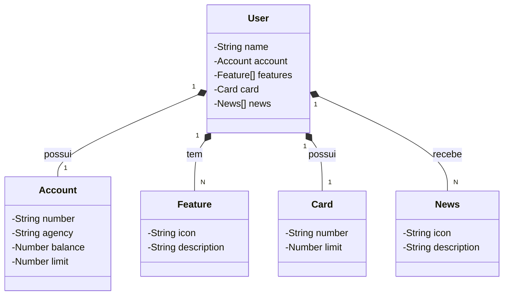

# 🏦 API Simulação Bancária Santander (Java/Spring Boot) 🚀

Este projeto é uma API RESTful desenvolvida em **Java** com **Spring Boot**, que simula as funcionalidades principais de uma conta bancária digital, inspirada no ecossistema do Santander. O projeto foi criado como parte do curso de Programação Back-end em parceria com o **Santander** e a **DIO (Digital Innovation One)**.

---

## 🛠️ Tecnologias Utilizadas

| Tecnologia | Versão | Propósito |
| :--- | :--- | :--- |
| **Linguagem** | Java 21 | Linguagem de programação principal. |
| **Framework** | Spring Boot 3.5.5 | Plataforma para desenvolvimento de aplicações Spring. |
| **Persistência** | Spring Data JPA | Facilita a interação com o banco de dados. |
| **Banco de Dados** | H2 (em Memória) | Usado para desenvolvimento e testes rápidos. |
| **Documentação** | **Swagger (OpenAPI 2.8.9)** | Geração automática de documentação interativa da API. |

---

## 🏗️ Modelo de Domínio

O sistema é centrado na entidade `User`, que agrega as informações financeiras e de serviço do cliente.



## 🚀 Funcionalidades da API (Endpoints)

O **`UserController`** expõe as operações de gerenciamento de clientes.

| Operação | Método | Endpoint | Comportamento em caso de Sucesso |
| :--- | :--- | :--- | :--- |
| **Buscar Usuário** | `GET` | `/users/{id}` | Retorna as informações completas do cliente (**200 OK**). |
| **Criar Usuário** | `POST` | `/users` | Insere um novo cliente e retorna o recurso criado (**201 Created**). |

### Tratamento de Exceções

A API utiliza um **`GlobalExceptionHandler`** para garantir respostas de erro claras e padronizadas.

| Exceção | Status HTTP Retornado | Propósito |
| :--- | :--- | :--- |
| `NoSuchElementException` | **404 Not Found** | Recurso não encontrado por ID (ao buscar um cliente). |
| `IllegalArgumentException` | **422 Unprocessable Entity** | Erros de regra de negócio (ex: número de conta duplicado). |
| `Throwable` | **500 Internal Server Error** | Falhas inesperadas do sistema. |

---

## 📝 Como Rodar o Projeto

### Pré-requisitos
Certifique-se de ter o **Java 21** e o **Gradle** instalados.

### Clonar o Repositório

```bash
git clone [https://github.com/Samuel-Erbet/java_spring_railway]
cd java_spring_railway
```

### Compilar e Executar

```Bash
# O comando abaixo limpa o projeto, baixa as dependências corrigidas (SpringDoc 2.8.9) e executa a aplicação.
./gradlew clean bootRun
```


Acessar a Documentação
A aplicação estará disponível em http://localhost:8080.

Swagger UI (Interface Interativa): Acesse http://localhost:8080/swagger-ui/
